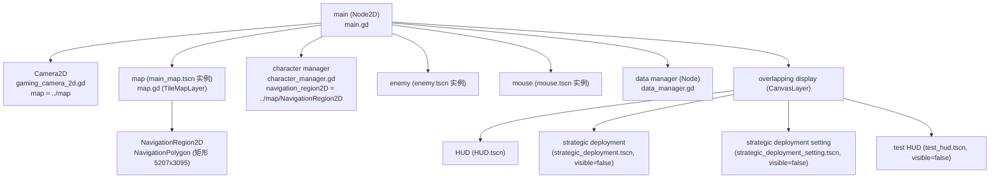
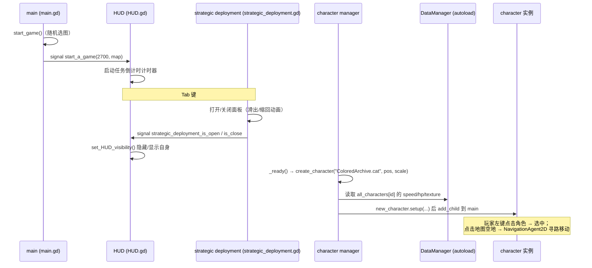

# ColoredArchive（彩色档案）开发者文档

> 本文档面向希望参与 ColoredArchive（缩写 **CA**）项目开发的开发者，内容基于当前 `game/` 目录下的实际代码、场景、配置与策划文档编写，请以代码仓库最新内容为准。

- **项目名称**：ColoredArchive / 彩色档案
- **当前版本**：v0.1.6
- **游戏类型**：2D 像素风 RTT（实时战术，Real-Time Tactics）
- **开发引擎**：Godot 4.7.1（GDScript）
- **版权声明**：本项目免费、完全开源，游戏内角色与世界观设定版权属于韩国 NEXON 公司与上海星啸网络科技有限公司，本项目仅保留著作权。**不得用于盈利。**

---

## 目录

1. [项目概览](#1-项目概览)
2. [技术栈与运行环境](#2-技术栈与运行环境)
3. [目录结构](#3-目录结构)
4. [系统架构](#4-系统架构)
5. [核心脚本详解](#5-核心脚本详解)
6. [场景文件详解](#6-场景文件详解)
7. [数据格式规范](#7-数据格式规范)
8. [输入映射](#8-输入映射)
9. [策划数值附录](#9-策划数值附录)
10. [扩展指南](#10-扩展指南)
11. [贡献与版本规范](#11-贡献与版本规范)
12. [已知问题与路线图](#12-已知问题与路线图)

---

## 1. 项目概览

### 1.1 项目定位

ColoredArchive 是一款使用 Godot 与 GDScript 开发的 **2D 像素风 RTT 游戏**，目标方向是《蔚蓝档案》（Blue Archive）同人游戏。v0.1.3 之前使用 Python + pygame 开发（该版本已废弃，存放于 `python_old/` 目录，不再维护）。

### 1.2 当前功能状态

截至 v0.1.6，项目已实现：

- 2D 像素地图（`grass` 草地地图）与瓦片地图边界限制
- 相机自由移动（WASD）与缩放（滚轮）、垂直同步模式与最大帧率可在编辑器中实时配置
- 角色系统：选中 / 取消选中、基于 `NavigationAgent2D` + `NavigationRegion2D` 的寻路移动、状态机雏形
- 敌人节点（占位，逻辑未实现）
- HUD：任务倒计时显示、调试 HUD（FPS，F3 开关）
- 战略配备（Strategic Deployment）面板：Tab 开关、左侧滑出动画、任务预算显示、配备按钮单选
- 自定义鼠标图标（普通 / 可点击两态，支持 4K 分辨率自动切换 32x32 / 64x64）
- 数据层：`DataManager`（autoload）管理角色与战略配备字典

### 1.3 项目来源

- GitHub：[SanmiaoDiary/Colored_Archive](https://github.com/SanmiaoDiary/Colored_Archive)
- Gitee：[sanmiaodiary/colored_archive](https://gitee.com/sanmiaodiary/colored_archive)

---

## 2. 技术栈与运行环境

| 项目 | 说明 |
|------|------|
| 引擎 | Godot **4.5 及以上**（项目当前以 4.7.1 开发，`.vscode/settings.json` 中配置的编辑器路径为 `Godot_v4.7.1-stable_win64.exe`） |
| 语言 | GDScript |
| 渲染方式 | `rendering/renderer/rendering_method="mobile"` |
| 窗口尺寸 | 1920 x 1200 |
| 插件 | `addons/godot_ai/`（Godot AI/MCP 辅助插件，**与游戏逻辑无关**，可忽略） |

> 注意：必须使用**标准版** Godot。下载 C# 版本可能导致项目无法运行。

### 2.1 开发工具建议

- **编辑器**：Godot 官方编辑器（导入 `game/project.godot`）
- **VSCode**：可通过 Godot Tools 扩展配合 `.vscode/settings.json` 使用，其中 `godotTools.editorPath.godot4` 指向本机 Godot 4.7.1 可执行文件路径（按需修改）
- **运行**：在 Godot 中打开项目后按 `F5`

---

## 3. 目录结构

### 3.1 仓库根目录

```
ColoredArchive/
├── README.md              # 项目介绍、部署教程、第三方资产与声明
├── updateplan.md          # 策划数值参考表（护甲、穿甲、伤害、地图debuff、任务）
├── DEVELOPER.md           # 本文档
├── example_code.md        # 示例代码说明
├── game/                  # ★ Godot 项目主目录（唯一活跃开发目录）
├── python_old/            # 废弃的 Python + pygame 版本（v0.1.3 前，不再维护）
├── project_file/          # 源工程文件（PSD 图片源文件，如 KivotosMap.psd）
├── back_up/               # 备份目录
└── LICENSE.md             # 开源许可证
```

### 3.2 game/（Godot 项目主目录）

```
game/
├── project.godot                 # Godot 项目配置（名称/版本/主场景/autoload/输入映射/窗口/渲染）
├── export_presets.cfg            # 导出预设（Web / Windows Desktop）
├── update_log.md                 # 更新日志（版本历史）
├── assets/
│   ├── code/                     # ★ 全部 GDScript 脚本
│   ├── scene/                    # ★ 全部场景（.tscn）
│   ├── images/                   # 图片资源（角色贴图、鼠标图标、地图、Logo 等）
│   ├── fonts/                    # 字体（Minecraft AE 字体，支持中文）
│   ├── musics/                   # 音乐（Constant Moderato.mp3）
│   ├── languages/                # 多语言 JSON（en.json、zh_cn.json，当前为空模板）
│   └── styles/                   # 主题/样式资源（.tres，用于 Label 背景等）
├── mods/
│   └── example_mod/              # 示例 MOD（example_mod.py，Python 占位，无实质作用）
├── plan/                         # 策划文档（plan.txt 与 CA企划.docx）
├── saves/                        # 存档目录（new_save.json、save_test.db 测试用）
├── addons/
│   └── godot_ai/                 # Godot AI/MCP 插件（第三方，与游戏逻辑无关）
└── .vscode/
    └── settings.json             # VSCode 编辑器路径配置
```

### 3.3 assets/code/（脚本清单，共 14 个）

| 脚本 | 作用 |
|------|------|
| `main.gd` | 主场景根节点逻辑：开始游戏信号、随机选图 |
| `data_manager.gd` | 全局数据管理（autoload）：角色 / 战略配备字典 |
| `character_manager.gd` | 角色管理器：创建 / 删除角色实例 |
| `character.gd` | 角色（CharacterBody2D）：选中、状态机、寻路移动 |
| `enemy.gd` | 敌人节点脚本（空实现，待开发） |
| `gaming_camera_2d.gd` | 相机：移动、缩放、垂直同步、帧率、地图限位 |
| `mouse.gd` | 全局鼠标图标管理（autoload） |
| `HUD.gd` | HUD：任务倒计时、根据战略配备面板状态显隐 |
| `map.gd` | 瓦片地图（TileMapLayer）：计算地图边界 |
| `strategic_deployment.gd` | 战略配备面板：Tab 开关、滑出动画、任务预算 |
| `strategic_deployment_button.gd` | 战略配备按钮：创建按钮、选中动画、单选逻辑 |
| `strategic_deployment_setting.gd` | 战略配备设置面板（空实现） |
| `test_hud.gd` | 调试 HUD：FPS 显示、F3 开关 |
| `character_state_machine_test.gd` | 角色状态机测试（空实现） |

---

## 4. 系统架构

### 4.1 全局单例（Autoload）

在 `project.godot` 的 `[autoload]` 中注册了 2 个全局单例：

| 单例名 | 脚本 | 说明 |
|--------|------|------|
| `Mouse` | `res://assets/code/mouse.gd` | 全局鼠标图标管理，任何节点可直接调用 `Mouse.mouse_can_click()` / `Mouse.mouse_can_not_click()` |
| `DataManager` | `res://assets/code/data_manager.gd` | 全局数据字典，任何节点可直接读取 `DataManager.all_characters` / `DataManager.all_strategic_deployment` |

```ini
[autoload]

Mouse="*res://assets/code/mouse.gd"
DataManager="*res://assets/code/data_manager.gd"
```

### 4.2 主场景节点树（main.tscn）



### 4.3 信号与数据流



### 4.4 角色移动实现原理

`character.gd` 使用 Godot 4 的导航系统：

1. `move_ready()` 中通过 `navigation_region2D.get_rid()` 获取导航地图 RID，配置 `NavigationAgent2D`（`max_speed`、`avoidance`、`radius`）。
2. `_unhandled_input` 中鼠标左键点击空地时，将点击坐标设为 `navigation_agent2D.target_position` 并置 `state["move"] = true`。
3. `move()` 中每帧调用 `get_next_path_position()` 获得下一路径点，`move_and_slide()` 驱动角色沿路径移动；到达目标点后复位状态。

---

## 5. 核心脚本详解

### 5.1 `main.gd`（主场景根节点）

- **信号**：`start_a_game` —— 一局新游戏开始（携带 `mission_countdown` 任务倒计时秒数与 `map` 地图名）。
- **变量**：`all_map = ["grass"]` 允许的地图列表；`character_num` 角色数量计数。
- **关键函数**：
  - `start_game()`：初始化任务倒计时 `2700` 秒，从 `all_map` 随机选一张地图，`emit(mission_countdown, map)` 发出信号。
  - `create_character()`：示例方法，实例化 `character.tscn` 并加入场景。
- **连接**：`start_a_game` 信号与 HUD 的 `_on_main_start_a_game()` 连接（见 main.tscn 的 connection 区段）。

### 5.2 `data_manager.gd`（autoload，全局数据）

全局数据字典（详见 [第 7 章 数据格式规范](#7-数据格式规范)）：

- `all_characters`：所有角色数据，键格式 `"拥有者.角色名"`。
- `all_strategic_deployment`：所有战略配备数据，键格式 `"拥有者.战略配备名"`。

当前内置数据：

| 字典 | 键 | 内容 |
|------|-----|------|
| `all_characters` | `"ColoredArchive.cat"` | 猫（测试角色） |
| `all_characters` | `"ColoredArchive.Sunaookami Shiroko"` | 砂狼白子（沙狼白子） |
| `all_strategic_deployment` | `"ColoredArchive.reinforcements"` | 增援 |
| `all_strategic_deployment` | `"ColoredArchive.resupply"` | 补给 |
| `all_strategic_deployment` | `"ColoredArchive.mg-43"` | MG-43 |
| `all_strategic_deployment` | `"ColoredArchive.fast_resupply"` | 快速补给 |
| `all_strategic_deployment` | `"ColoredArchive.mk-2"` | MK-2 |
| `all_strategic_deployment` | `"ColoredArchive.L118"` | L118 |

### 5.3 `character_manager.gd`（角色管理器）

管理当前对局中的角色实例。

- **变量**：`have_characters`（当前对局角色实例字典）；`father_node = get_parent()`（将角色实例加入父节点 `main`）；`CHARACTER_SCENE`（预加载 `character.tscn`）；`all_characters = DataManager.all_characters`；`@export navigation_region2D`（导航区域节点，检查器中指定为 `../map/NavigationRegion2D`）。
- **`create_character(id, position, scale)`**：从 `DataManager.all_characters` 读取 `speed` / `hp` / `texture`，实例化角色场景，调用 `setup(id, position, scale, hp, speed, texture, navigation_region2D)`，`call_deferred` 添加到父节点，并存入 `have_characters[id]`。
- **`delete_character(id)`**：校验实例有效后 `queue_free()` 并移除字典键。
- **`_ready()`**：清空旧角色后创建测试角色 `"ColoredArchive.cat"`（位于 `(683, 502)`）。后续应改为通过信号接收角色 id 创建。

### 5.4 `character.gd`（角色）

继承 `CharacterBody2D`，单角色逻辑核心。

- **`setup(id, position, scale, hp, speed, texture, navigation_region2D)`**：初始化角色数据、设置贴图纹理、位置缩放，并调用 `move_ready()` 配置导航。
- **状态机（`state` 字典）**：`selection`（选中）、`action`（动作）、`move`（移动）三个状态位；`state_machine()` 根据 `state["move"]` 分派 `move()` 或 `standby()`。
- **输入处理（`_unhandled_input`）**：
  - 鼠标左键点击角色本体 → 切换选中状态（`be_selection()` / `cancel_selection()`，控制选中框显示）。
  - 鼠标左键点击非角色区域 → 将点击位置设为 `navigation_agent2D.target_position`，置 `state["move"] = true`。
- **移动**：`move()` 内使用 `get_next_path_position()` + `move_and_slide()`；到达目标点后若 `debug_enabled` 则输出调试信息。
- **相关场景 `character.tscn` 节点树**：

```
character (CharacterBody2D)
├── character texture (Sprite2D)      # 角色贴图
├── character collision (CapsuleShape2D) # 碰撞体
├── character selection box (Sprite2D)   # 选中框（默认隐藏）
├── mouse (Area2D)                    # 鼠标点击检测区域
└── NavigationAgent2D                 # 导航代理
```

### 5.5 `enemy.gd`（敌人，占位）

继承 `CharacterBody2D`，当前为空实现，供后续敌人 AI 开发使用。

### 5.6 `gaming_camera_2d.gd`（相机）

继承 `Camera2D`，挂载于主场景 `Camera2D` 节点。

- **可导出参数（检查器中可实时修改）**：
  - `camera_speed = 500`（移动速度）、`camera_zoom_speed = 5`（缩放速度）
  - `camera_zoom_max = (4, 4)`、`camera_zoom_min = (0.2, 0.2)`
  - `camera_default_location = (500, 800)`（默认位置）
  - `map: Node2D`（检查器中指向 `../map`）
  - `max_fps = 120`（最大帧率，修改立即生效）
  - `vsync_mode`（枚举：`DISABLED` / `ENABLED` / `ADAPTIVE` / `MAILBOX`，setter 中立即应用）
- **`move_camera(delta)`**：读取 `w_down` / `a_down` / `s_down` / `d_down` 输入，归一化方向后按速度移动。
- **`camera_zoom(delta)`**：读取 `zoom_in` / `zoom_out` 输入（滚轮），缩放并 clamp 到最小/最大范围。
- **`_ready()`**：应用垂直同步与帧率、启用相机、获取地图边界并启用 `limit` 限制（`limit_top/bottom/left/right`），初始化相机位置。

### 5.7 `mouse.gd`（autoload，全局鼠标）

- **贴图**：预加载 4 张鼠标图标（常规 / 可点击 × 32x32 / 64x64）。
- **`set_mouse_icon()`**：根据窗口高度选择图标——窗口高度 `>= 2000`（约 4K）用 64x64，否则 32x32；根据 `selectable` 切换常规/可点击图标。
- **`_process()`**：监听窗口高度变化，变化时重新设置图标。
- **对外接口**：`mouse_can_click()`（设为可点击）、`mouse_can_not_click()`（设为不可点击）。

### 5.8 `HUD.gd`（HUD）

继承 `Control`，挂载于 `overlapping display` CanvasLayer 下。

- **节点引用**：`mission_countdown_Timer_lable`（倒计时 `Timer`）、`mission_countdown_lable`（倒计时文本 Label）。
- **`_on_main_start_a_game(mission_countdown)`**：接收主场景信号，设置计时器 `wait_time` 并 `start()`。
- **`_process()`**：将剩余时间格式化为 `MM:SS` 显示。
- **`set_HUD_visibility()`**：当战略配备面板打开（`strategic_deployment_panel_is_open == true`）时隐藏自身，否则显示。
- **信号连接**：接收 `strategic_deployment` 的 `strategic_deployment_is_open` / `is_close` 信号（`_on_strategic_deployment_strategic_deployment_is_open/close()`）。

### 5.9 `map.gd`（瓦片地图）

继承 `TileMapLayer`，用于计算地图边界。

- **`get_boundaries() -> Dictionary`**：读取 `tile_set.tile_size` 与 `get_used_rect()`，计算：
  - `top_limit = 0`、`left_limit = 0`
  - `bottom_limit = 地图高度瓦片数 × tile_height`
  - `right_limit = 地图宽度瓦片数 × tile_width`
- 返回字典 `{ "top_limit", "bottom_limit", "left_limit", "right_limit" }`，供相机限位使用。

### 5.10 `strategic_deployment.gd`（战略配备面板）

继承 `Control`，位于 `overlapping display` CanvasLayer 下。

- **信号**：`strategic_deployment_is_open` / `strategic_deployment_is_close`（通知 HUD 显隐）。
- **变量**：`cost = 30000`（任务预算）；`cost_lable` 显示 `"任务预算:xxx"`；`init_position = (-120, 0)`（初始位置，面板从左侧滑入）。
- **`_unhandled_input`**：`Tab_down` 键切换面板开关。
- **动画**：使用 `Tween`（`TRANS_QUAD`）实现左滑出/缩回；缩回后自动隐藏节点。
- **窗口尺寸变化响应**：面板位置随窗口尺寸自适应。

### 5.11 `strategic_deployment_button.gd`（战略配备按钮）

继承 `TextureButton`，动态生成配备按钮。

- **内部类 `strategic_deployment_buttons`**：`_init(manager, id, name, cd, button_position, button_icon)` 存储单个按钮数据。
- **控制端**：
  - `create_button()`：遍历 `DataManager.all_strategic_deployment` 生成按钮，记录到 `all_strategic_deployment_dict`。
  - `be_selected()` / `cancel_select()`：选中/取消选中时的浮动动画。
  - `control_button_only_one_can_select(id)`：保证同一时间只有一个按钮处于选中状态。
- **信号连接**：`pressed` / `mouse_entered` / `mouse_exited`（鼠标悬停时切换可点击鼠标图标）。

### 5.12 `strategic_deployment_setting.gd`（战略配备设置面板）

继承 `Panel`，当前为空实现，预留设置面板功能。

### 5.13 `test_hud.gd`（调试 HUD）

继承 `Control`。

- **`_process()`**：实时显示 `FPS:{当前帧率}`。
- **F3 切换**：`F3_down` 输入切换调试 HUD 显隐（`show_test_HUD()` / `hide_test_HUD()`）。
- 默认隐藏。

### 5.14 `character_state_machine_test.gd`（状态机测试）

继承 `CharacterBody2D`，当前为空实现，用于测试角色状态机设计。

---

## 6. 场景文件详解

`game/assets/scene/` 下共有 12 个场景文件：

| 场景 | 用途 | 关键脚本 |
|------|------|----------|
| `main.tscn` | 主场景（入口） | `main.gd`、`gaming_camera_2d.gd`、`character_manager.gd`、`data_manager.gd` |
| `character.tscn` | 角色预制体 | `character.gd` |
| `enemy.tscn` | 敌人预制体 | `enemy.gd` |
| `mouse.tscn` | 鼠标图标节点 | `mouse.gd` |
| `HUD.tscn` | HUD 界面 | `HUD.gd` |
| `strategic_deployment.tscn` | 战略配备面板 | `strategic_deployment.gd`、`strategic_deployment_button.gd` |
| `strategic_deployment_setting.tscn` | 战略配备设置 | `strategic_deployment_setting.gd` |
| `test_hud.tscn` | 调试 HUD | `test_hud.gd` |
| `main_map.tscn` | 草地地图 | `map.gd` |

> 其余场景为资源/测试场景。所有 `.tscn` 均有对应的 `.uid` 文件（Godot 4.4+ 资源 UID 系统）。

### 6.1 main.tscn 关键连接

- `main.start_a_game` → `HUD._on_main_start_a_game`
- `strategic deployment.strategic_deployment_is_open` → `HUD._on_strategic_deployment_strategic_deployment_is_open`
- `strategic deployment.strategic_deployment_is_close` → `HUD._on_strategic_deployment_strategic_deployment_is_close`

### 6.2 main_map.tscn

- `TileMapLayer` 使用瓦片图集绘制草地（grass_green / grass_yellow 等）。
- 内含 `NavigationRegion2D`（`NavigationPolygon` 矩形约 5207x3095），作为角色寻路区域。

---

## 7. 数据格式规范

### 7.1 角色数据（`DataManager.all_characters`）

```gdscript
var all_characters = {
	"ColoredArchive.cat": {
		"name": "cat",
		"school": "ColoredArchive",
		"speed": 250,
		"hp": 100,
		"icon": preload("res://assets/images/cat.png"),
		"texture": preload("res://assets/images/cat.png"),
	},
	"ColoredArchive.Sunaookami Shiroko": {
		# ... 结构同上（砂狼白子）
	},
}
```

**键命名规则**：`"拥有者.角色名"`（如 `"ColoredArchive.cat"`）。

**字段说明**：

| 字段 | 类型 | 说明 |
|------|------|------|
| `name` | String | 显示名称 |
| `school` | String | 所属（学校/阵营） |
| `speed` | float | 移动速度 |
| `hp` | int | 生命值 |
| `icon` | Texture | 界面图标（预加载资源） |
| `texture` | Texture | 角色贴图（预加载资源） |

### 7.2 战略配备数据（`DataManager.all_strategic_deployment`）

```gdscript
var all_strategic_deployment = {
	"ColoredArchive.reinforcements": {
		"name": "增援",
		"cd": 30,
		"icon": preload("res://assets/images/reinforcements.png"),
	},
	# 其余：resupply / mg-43 / fast_resupply / mk-2 / L118
}
```

**字段说明**：

| 字段 | 类型 | 说明 |
|------|------|------|
| `name` | String | 显示名称 |
| `cd` | float/int | 冷却时间（秒） |
| `icon` | Texture | 按钮图标（预加载资源） |

### 7.3 存档格式（saves/new_save.json 示例）

```json
{
	"save_name": "新的存档",
	"save_id": 1515260,
	"save_close": 1233,
	"have_characters": ["Sunaookami_Shiroko"],
	"point": 1200,
	"roke": 1200,
	"use_mods": [],
	"create_time": "2025-9-21",
	"kill_enemy": 0,
	"reinforcements": 0,
	"palytime": 1200
}
```

> 说明：当前存档系统尚在测试阶段（`save_test.db` 为 SQLite 测试文件），字段含义以策划后续确认的为准。

---

## 8. 输入映射

以下输入动作在 `project.godot` 的 `[input]` 区段定义：

| 动作名 | 默认按键 | 用途 |
|--------|----------|------|
| `w_down` | W | 相机向上移动 |
| `a_down` | A | 相机向左移动 |
| `s_down` | S | 相机向下移动 |
| `d_down` | D | 相机向右移动 |
| `mouse_left_down` | 鼠标左键 | 角色选中 / 下达移动指令 |
| `mouse_right_down` | 鼠标右键 | （预留） |
| `Tab_down` | Tab | 开关战略配备面板 |
| `Esc_down` | Esc | （预留） |
| `zoom_in` | 滚轮向上 | 相机放大 |
| `zoom_out` | 滚轮向下 | 相机缩小 |
| `F3_down` | F3 | 开关调试 HUD |

---

## 9. 策划数值附录

> 以下内容摘自 `updateplan.md`，为策划参考数值，尚未全部实现于代码。

### 9.1 护甲等级参考表

| 等级 | 类别 | 典型单位示例 |
|------|------|--------------|
| 0 | 无甲 | 平民、裸露设施 |
| 1 | 轻甲 I | 侦察兵、轻型无人机 |
| 2 | 轻甲 II | 标准步兵、突击兵 |
| 3 | 中甲 I | 精英步兵、战术机甲 |
| 4 | 中甲 II | 重装步兵、防爆盾兵 |
| 5 | 重甲 I | 外骨骼装甲、重型机甲 |
| 6 | 重甲 II | 超重型步兵、小型炮台 |
| 7 | 轻型装甲车 / 自行火炮 | 装甲运兵车、自行反坦克炮 |
| 8 | 主战坦克 | 标准主战坦克、中型坦克 |
| 9 | 重型坦克 / 移动堡垒 | 重型突击坦克、巨型移动要塞 |
| 10 | 堡垒 | 钢筋混凝土永备工事、要塞炮台 |
| 11 | 地堡 | 地下指挥所、深层掩体 |
| 12 | 地下工事 / 永固工事 | 核战避难所、山体要塞 |

### 9.2 穿甲等级

与护甲等级相同（0–12 级）。

### 9.3 伤害计算机制

单位拥有两套数值体系：

- **血量（HP）**：有生命的单位才有 HP；`HP <= 0` 即死亡（无论剩余多少结构值）。
- **护甲结构值（护甲耐久）**：没有生命的单位无 HP；结构值 `<= 0` 即死亡。

子弹包含三类伤害：直击伤害、爆炸伤害（AOE）、结构值伤害。

### 9.4 穿甲机制（护甲等级 − 穿甲等级）

| 差值 | 效果 |
|------|------|
| `>= 3` | 只能对结构值造成 **1** 伤害（打不穿） |
| `= 2` | 伤害 **-50%**，结构值伤害 **+50%**（快速碎甲） |
| `= 1` | 伤害 **-25%**，结构值伤害 **-25%**（碎甲，造成部分伤害） |
| `= 0` | 伤害不变，结构值伤害不变（正常伤害） |
| `<= -1` | 爆炸伤害 **-10%**，结构值伤害 **+50%**（过穿） |
| `<= -2` | 爆炸伤害 **-20%**，结构值伤害 **+100%**（过穿） |
| `<= -3` | 爆炸伤害 **-30%**，结构值伤害 **+200%**（过穿） |
| `<= -4` | 爆炸伤害 **-40%**，结构值伤害 **+400%**（过穿） |
| `<= -5` | 爆炸伤害 **-50%**，结构值伤害 **+800%**（过穿） |
| `<= -6` | 爆炸伤害 **-60%**，结构值伤害 **+800%**（过穿） |

### 9.5 地图 Debuff

| Debuff | 效果 |
|--------|------|
| 更远的机场 | 所有用到飞行器的战略配备抵达时间 +25% |
| 更远的直升机场 | 所有用到直升机的战略配备抵达时间 +25% |
| 复杂电磁环境 | 所有战略配备抵达时间 +15%；战略配备有 25% 几率呼叫失败 |
| 沙尘暴 | 战争迷雾覆盖范围 +80%；单位可见范围 -80% |
| 紧张的任务预算 | 初始任务预算 -20%；任务预算回复时间 +20%；每次回复的任务预算 -20% |

### 9.6 主线任务类型

- 摧毁所有机器人工厂（**闪击战**）
- 消灭所有敌人（**歼灭战**）
- 在数据传输完成之前保护信号塔（**保卫战**）
- 发射航空火箭：填充航空燃料 → 启动发射场发电机 → 升起雷达塔
- 运输目标物资

---

## 10. 扩展指南

### 10.1 如何新增角色

1. **准备贴图**：将角色贴图放入 `game/assets/images/`（建议 PNG，像素风）。
2. **注册数据**：在 `game/assets/code/data_manager.gd` 的 `all_characters` 字典中新增键值对：

```gdscript
"ColoredArchive.新角色名": {
	"name": "显示名",
	"school": "ColoredArchive",
	"speed": 250,          # 移动速度
	"hp": 100,             # 生命值
	"icon": preload("res://assets/images/新角色图标.png"),
	"texture": preload("res://assets/images/新角色贴图.png"),
},
```

3. **创建实例**：在需要生成角色的地方调用角色管理器：

```gdscript
# 在 character_manager.gd 或信号回调中
create_character("ColoredArchive.新角色名", Vector2(100, 100), Vector2(1, 1))
```

### 10.2 如何新增战略配备

1. **准备图标**：将按钮图标放入 `game/assets/images/`。
2. **注册数据**：在 `data_manager.gd` 的 `all_strategic_deployment` 字典中新增：

```gdscript
"ColoredArchive.新配备名": {
	"name": "显示名",
	"cd": 30,             # 冷却时间（秒）
	"icon": preload("res://assets/images/新配备图标.png"),
},
```

3. **实现效果**：在 `strategic_deployment_button.gd` 的按钮 `pressed` 回调中编写调用逻辑（当前按钮只负责选中态管理，效果逻辑待开发）。

### 10.3 如何新增地图

1. 在 `game/assets/scene/` 下创建新的地图场景（TileMapLayer + NavigationRegion2D）。
2. 在 `main.gd` 的 `all_map` 列表中加入新地图名。
3. 在 `start_game()` 的选图逻辑中接入对应场景加载。

### 10.4 MOD 系统说明

`game/mods/` 目前仅有 `example_mod/example_mod.py`——这是一个 **Python 占位示例文件，没有任何实质作用**。项目曾在 v0.1.1 提及"添加了一个 modapi——water 和一个示例 mod"，但当前 MOD API 尚未实现。若开发 MOD 系统，建议在 `mods/` 下以独立目录存放，并通过加载器动态注册。

### 10.5 开发约定

- 脚本路径一律使用 `res://` 前缀（如 `preload("res://assets/scene/character.tscn")`）。
- 数据字典统一由 `DataManager` 管理，键名格式 `"拥有者.名称"`。
- 输入动作统一在 `project.godot` 的 `[input]` 中定义，不要在代码中直接使用裸键码。
- 新增可配置项优先使用 `@export` 以便在检查器中调整。

---

## 11. 贡献与版本规范

### 11.1 分支策略

- `master` / `develop` 分支；当前开发基于 `develop`。
- 废弃的 Python 版本存放于 `python_old/`（曾在独立分支，已合并回主分支），不再维护。

### 11.2 更新日志规范（game/update_log.md）

每次修改代码后必须：

1. 在 `game/update_log.md` 顶部按版本号格式追加条目：

```markdown
# v0.1.7
## 2026.XX.XX
### [添加]
- 新功能描述
### [修改]
- 修改描述
### [修复]
- 修复描述
```

2. 执行 `git add -A` 与 `git commit`，提交信息格式：`v版本号: 简短描述`（如 `v0.1.7: 添加XX功能`）。

### 11.3 问题记录规范

测试中发现的问题记录在项目根目录 `issues.md` 中（如不存在则创建），问题解决后需更新对应状态（如 `- [x]` 表示已解决、`- [ ]` 表示未解决），示例见 `game/update_log.md` 中的"已知问题"区段。

---

## 12. 已知问题与路线图

### 12.1 当前已知问题（来自 update_log.md）

- 战略配备按钮鼠标悬停交互反馈不足，玩家难以意识到按钮可点击。
- 鼠标"可点击"状态的小绿点可见性不佳。

### 12.2 规划中的功能

- 敌人 AI 逻辑（`enemy.gd` 待实现）。
- 战略配备的实际效果逻辑（当前仅有按钮 UI）。
- 战略配备设置面板（`strategic_deployment_setting.gd` 待实现）。
- 角色状态机完善（`character_state_machine_test.gd` 测试中）。
- 存档系统完善。
- 移动端兼容（`rendering_method="mobile"` 已就绪，后续可能出手机版）。

---

*文档维护：每次代码变更后请同步更新本文档对应章节，并更新 `game/update_log.md`。*
